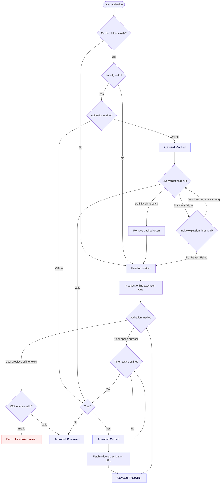

# moonbase-licensing

[](https://crates.io/crates/moonbase-licensing)
[](https://docs.rs/moonbase-licensing)

Rust client for the [Moonbase](https://moonbase.sh) licensing system,
supporting both online and offline activation flows.

License payloads are cached on disk.
License activation happens on a background thread and doesn't block the caller.

This crate does not come with a built-in UI. You will have to build your own UI,
consuming the `LicenseActivator`'s state changes and error notifications.

> This crate is sponsored by Moonbase, but not maintained by them.

## Usage

> For an example CLI using all library features, please visit [examples/cli.rs](examples/cli.rs)

The usage is simple: spawn a `LicenseActivator`, call `poll`, and read from the `error_recv` receiver periodically,
updating your UI and internal state in response.

```rust
use moonbase_licensing::{ActivationState, ActivationType, LicenseActivator};

// on application startup, spawn the license activator:
let config = /* ... configuration ... */;
let mut activator = LicenseActivator::spawn(config);

// then fetch status and errors regularly, for example on your UI thread:
if let Some(activation_state) = activator.poll() {
    match activation_state {
        ActivationState::NeedsActivation(activation_url_browser) => {
            // revoke access if it was provisionally granted by ActivationType::Cached
            // update GUI accordingly - if activation_url_browser is provided,
            // you can direct the user to open it in the browser,
            // if it is None, only offline activation is available at this point
        }
        ActivationState::Activated(claims, activation_type) => {
            match activation_type {
                ActivationType::Cached => {
                    // grant provisional access immediately and keep polling -
                    // online validation may confirm or revoke this activation
                }
                ActivationType::Confirmed => {
                    // activation has been confirmed - grant access and stop polling
                }
                ActivationType::Trial(followup_online_activation_url) => {
                    // a trial activation grants access and provides the URL
                    // to install a purchased license - keep polling
                }
            }

            // store claims (username, product version, etc.) as needed
        }
    }
}

while let Ok(error) = activator.error_recv.try_recv() {
    // an error has been encountered - display it to the user at your discretion
}

// to write a machine file to disk for offline activation:
let machine_file = activator.machine_file_contents();
std::fs::write(&path, &machine_file)?;

// to supply the offline license token obtained using the machine file:
activator.submit_offline_activation_token(&activation_token);
```

## Online token validation

Because Moonbase license tokens created using **Online** activation can be revoked
and re-assigned to different machines, every cached online token is revalidated
against the Moonbase API when the activator starts.

A cached token must first pass local signature, product, device, and expiration checks.
The activator then emits `Activated(claims, ActivationType::Cached)` immediately,
so the application can grant provisional access without waiting for the network.
Afterwards, keep polling: successful validation upgrades the state to `ActivationType::Confirmed`,
or to `ActivationType::Trial(url)` with an URL for follow-up online license activation.

`ActivationType::Cached` is provisional (i.e. locally valid but not yet validated against Moonbase) and can be revoked.
A definitive rejection from Moonbase deletes the cached token and emits `NeedsActivation` immediately.
For any other issues validating, such as missing internet connection, we retry
but give the user the benefit of the doubt by not revoking the until `online_token_expiration_threshold` is reached.

## Offline token expiration

Tokens created via **Offline** activation cannot be revoked and do not require a
Moonbase API check. A locally valid non-trial offline token emits
`ActivationType::Confirmed` immediately. An offline trial first emits `Cached` while
its follow-up URL is fetched, then `Trial(url)`. Offline tokens remain valid until
their signed expiration, if any, and only on the device whose signature they contain.

## Flow

Here's a rough overview of the `LicenseActivator`'s logic:


