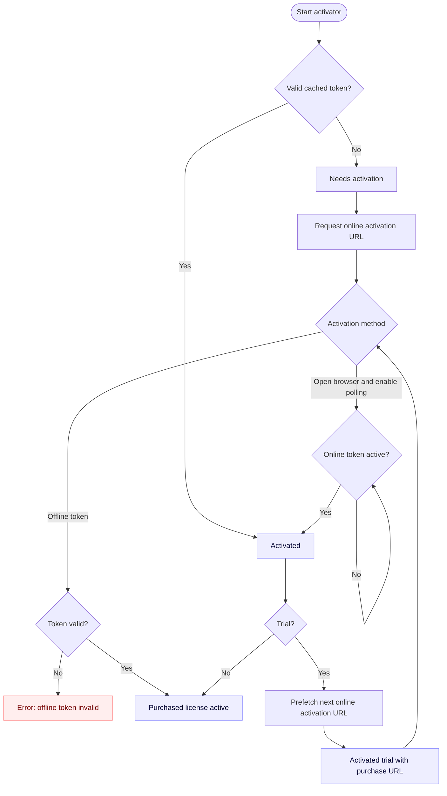

# moonbase-licensing
[](https://crates.io/crates/moonbase-licensing)
[](https://docs.rs/moonbase-licensing)

Rust client for the [Moonbase](https://moonbase.sh) licensing system,
supporting both online and offline activation flows.

License payloads are cached on disk and revalidated at configurable intervals.

License activation happens on a background thread and doesn't block the caller.

This crate does not come with a built-in UI. You will have to build your own UI,
consuming the `LicenseActivator`'s state changes and error notifications.

> This crate is sponsored by Moonbase, but not maintained by them.

## Usage

> For an example CLI using all library features, please visit [examples/cli.rs](examples/cli.rs)

The usage is simple: spawn a `LicenseActivator` and read from the `state_recv` and `error_recv` receivers periodically,
updating your UI and internal state in response.

```rust
// on application startup, spawn the license activator:
let config = /* ... configuration ... */;
let mut activator = LicenseActivator::spawn(config);

let mut purchased = false;

// then fetch status and errors regularly, for example on your UI thread:
if !purchased {
    while let Ok(activation_state) = activator.state_recv.try_recv() {
        match activation_state {
            ActivationState::NeedsActivation(activation_url_browser) => {
                // update GUI accordingly - if activation_url_browser is provided,
                // you can direct the user to open it in the browser,
                // if it is None, only offline activation is available at this point
            }
            ActivationState::Activated {
                claims,
                online_activation_url,
            } => {
                // activation has been successful - grant access and store the claims
                // (username, whether it's a trial, etc) somewhere for later use
                if claims.trial {
                    // if the activation was a trial activation,
                    // you can give the user the option to
                    // go through the activation flow again
                    // to install their real license.

                    if let Some(url) = online_activation_url {
                        // the URL for follow-up online activation checks.
                    }
                } else {
                    // a non-trial activation finishes the
                    // activator's flow, stop polling
                    purchased = true;
                    break;
                }
            }
        }
    }

    while let Ok(error) = activator.error_recv.try_recv() {
        // an error has been encountered - display it to the user at your discretion
    }
}

// to write a machine file to disk for offline activation:
let machine_file = activator.machine_file_contents();
std::fs::write(&path, &machine_file)?;

// to supply the offline license token obtained using the machine file:
activator.submit_offline_activation_token(&activation_token);
```

## Online token expiration

Because Moonbase license tokens created using **Online** activation can be revoked
and re-assigned to different machines, it is necessary to validate them
against the Moonbase API on a regular basis.

There are two age thresholds to supply to `LicenseActivator` to configure these validations:

- `online_token_refresh_threshold`: the age after which online tokens are attempted to be refreshed. Younger tokens
  are accepted without attempting online validation to log the user in instantly and preserve API quotas.
- `online_token_expiration_threshold` is the age after which an online token is deemed expired if it can't be refreshed.
  Younger tokens are accepted even if they can't be refreshed online, to give the user the benefit of the doubt and
  allow them to keep using the software if they have temporary connectivity issues.  
  Be careful not to set this value too high - users may take a device offline
  and keep using the software, even if the key has been retransferred to another device in the meantime,
  thus allowing them to exceed the limit of registered devices until the threshold is exceeded.

Sensible default values are 1 and 20 days, respectively.

## Offline token expiration

Tokens created via **Offline** activation cannot be revoked,
and are therefore valid forever unless the machine's device signature changes.

## Flow

Here's a rough overview of the `LicenseActivator`'s logic:


