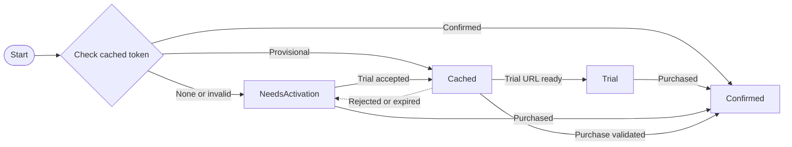

# moonbase-licensing

[](https://crates.io/crates/moonbase-licensing)
[](https://docs.rs/moonbase-licensing)

Rust client for the [Moonbase](https://moonbase.sh) licensing system,
supporting both online and offline activation flows.

License payloads are cached on disk and revalidated at configurable intervals.

License activation happens on a background thread and doesn't block the caller.

This crate does not come with a built-in UI. You will have to build your own UI,
consuming the `LicenseActivator`'s state changes and error notifications.

> This crate is sponsored by Moonbase, but not maintained by them.

## Usage

> For an example CLI using all library features, please visit [examples/cli.rs](examples/cli.rs)

The usage is simple: spawn a `LicenseActivator`, call `poll`, and read from the `error_recv` receiver periodically,
updating your UI and internal state in response.

```rust
use moonbase_licensing::{ActivationState, LicenseActivator};

// on application startup, spawn the license activator:
let config = /* ... configuration ... */;
let mut activator = LicenseActivator::spawn(config);

// then fetch status and errors regularly, for example on your UI thread:
if let Some(activation_state) = activator.poll() {
    // `activation_state.grants_access()` reports whether the state
    // grants the user access to the software, i.e. whether it isn't `NeedsActivation`
    match activation_state {
        ActivationState::NeedsActivation(activation_url_browser) => {
            // revoke access if it was provisionally granted by ActivationState::Cached
            // update GUI accordingly - if activation_url_browser is provided,
            // you can direct the user to open it in the browser,
            // if it is None, only offline activation is available at this point
        }
        ActivationState::Cached(claims) => {
            // grant provisional access immediately and keep polling -
            // online validation may confirm or revoke this activation
        }
        ActivationState::Confirmed(claims) => {
            // activation has been confirmed - grant access and stop polling
        }
        ActivationState::Trial(claims, followup_online_activation_url) => {
            // a trial activation grants access and provides the URL
            // to install a purchased license - keep polling
        }
    }

    // store claims (username, product version, etc.) as needed
}

while let Ok(error) = activator.error_recv.try_recv() {
    // an error has been encountered - display it to the user at your discretion
}

// to write a machine file to disk for offline activation:
let machine_file = activator.machine_file_contents();
std::fs::write(&path, &machine_file)?;

// to supply the offline license token obtained using the machine file:
activator.submit_offline_activation_token(&activation_token);
```

## Online activation polling

While `poll_online_activation` is true, the license activator polls the Moonbase API
to check if the user has activated the license online.

The flag is false initially. Set it to true when the user opens the online activation URL,
and set it to false whenever the user isn't on the online activation screen
to avoid spamming the Moonbase API and getting rate limited.

The flag is set to false automatically when a trial license is installed,
so you must enable it again if the user opens the follow-up online activation URL.

## Online token expiration

Because Moonbase license tokens created using **Online** activation can be revoked
and re-assigned to different machines, it is necessary to validate them
against the Moonbase API on a regular basis.

There are two age thresholds to supply to `LicenseActivator` to configure these validations:

- `online_token_refresh_threshold`: the age after which online tokens are attempted to be refreshed. Younger tokens
  are accepted without attempting online validation to log the user in instantly and preserve API quotas.
- `online_token_expiration_threshold` is the age after which an online token is deemed expired if it can't be refreshed.
  Younger tokens are accepted even if they can't be refreshed online, to give the user the benefit of the doubt and
  allow them to keep using the software if they have temporary connectivity issues.
  Be careful not to set this value too high - users may take a device offline
  and keep using the software, even if the key has been retransferred to another device in the meantime,
  thus allowing them to exceed the limit of registered devices until the threshold is exceeded.

The expiration threshold is always the hard limit for accepting a token without online validation,
even if the refresh threshold is configured to be longer.

Sensible default values are 1 and 20 days, respectively.

When online validation is attempted, a cached token must first pass local signature,
product, device, and expiration checks. The activator then emits
`Cached(claims)` immediately, so the application can grant
provisional access without waiting for the network. Afterwards, keep polling:
successful validation upgrades the state to `Confirmed(claims)`,
or to `Trial(claims, url)` with an URL for follow-up online license activation.

`Cached` is provisional (i.e. locally valid but not yet validated against Moonbase) and can be revoked.
A definitive rejection from Moonbase deletes the cached token and emits `NeedsActivation` immediately.
For any other issues validating, such as missing internet connection, we retry
but give the user the benefit of the doubt by not revoking the token until `online_token_expiration_threshold` is reached.

## Offline token expiration

Tokens created via **Offline** activation cannot be revoked and do not require a
Moonbase API check. A locally valid non-trial offline token emits
`Confirmed` immediately. An offline trial first emits `Cached` while
its follow-up URL is fetched, then `Trial(claims, url)`. Offline tokens remain valid until
their signed expiration, if any, and only on the device whose signature they contain.

## Flow

Here's a rough overview of the `LicenseActivator`'s logic:


